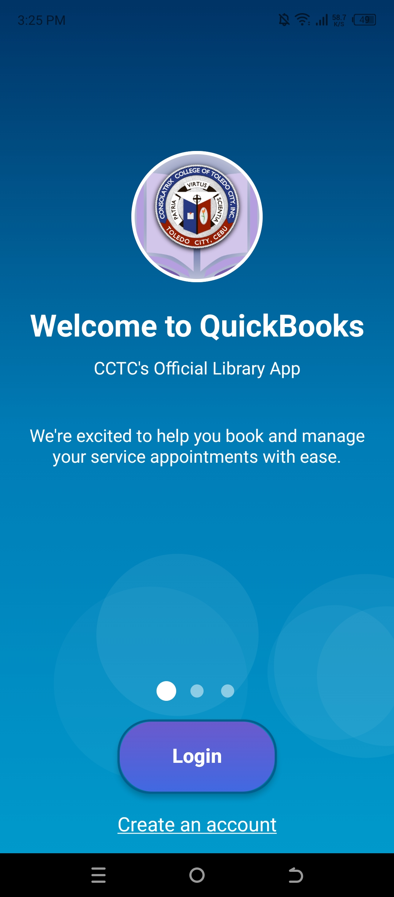
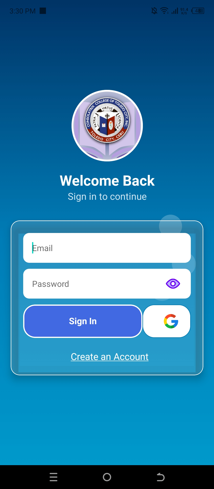
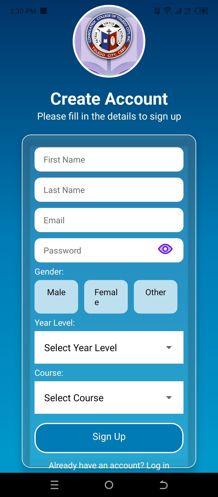
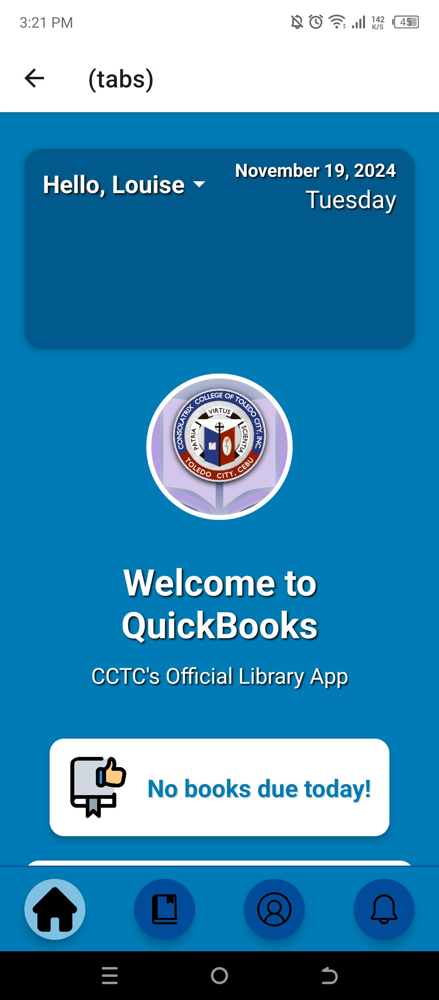
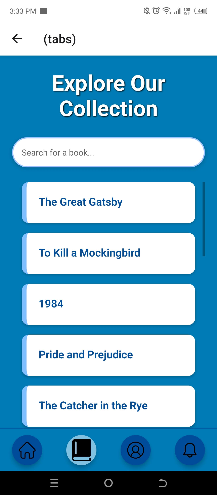
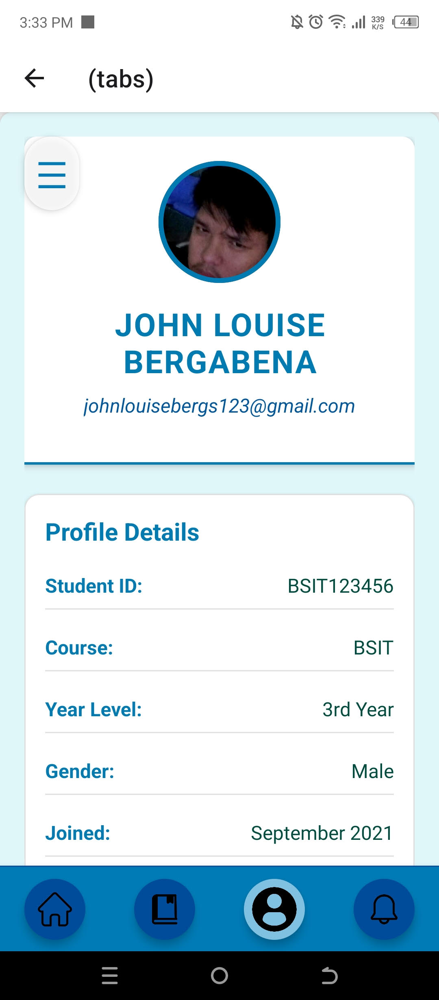
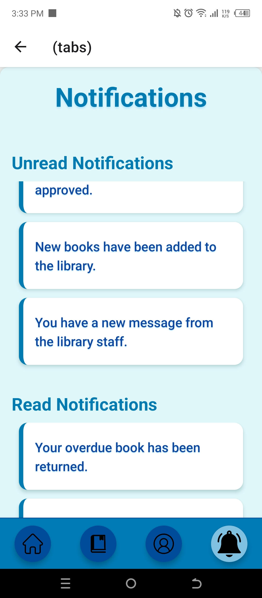

# QuickBooks
The QuickBooks Mobile App.

# Features
* Loan Books more efficiently.
* Browse the Library remotely.
* Set up book loaning appointments.

# Course Overview
* Basic React Native Components
* Database Design using Appwrite
* User Registration & Authenticaiton
* Deployment

# Tech Stack
* React Native
* AppWrite
* HTML, CSS and JS

# Home Screen
  

# Log In Screen
  

# Sign Up Screen
  

# Tab Screens
# Home Tab
  

# Book Browse Tab
 

# Profile Tab
 

# Notifications Tab
 

